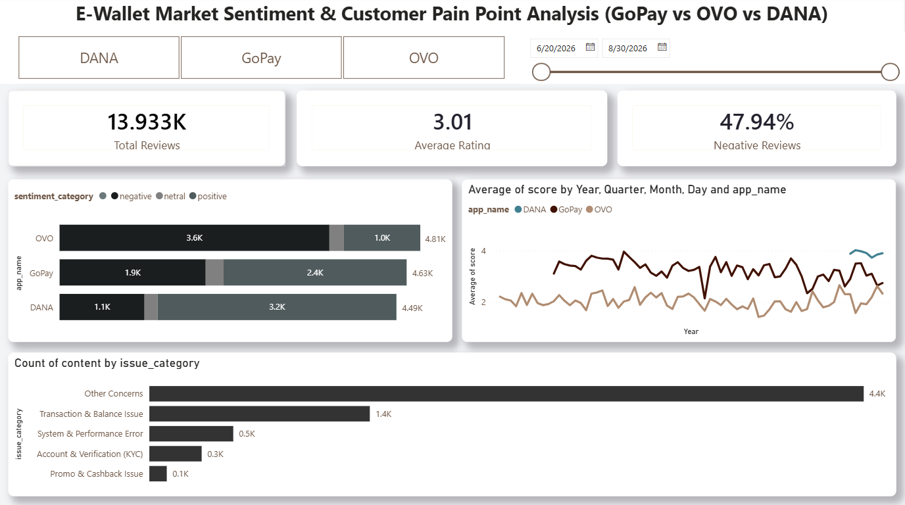

# E-Wallet Market Sentiment & Customer Pain Point Analysis
### (GoPay vs OVO vs DANA)

---
An end-to-end data analysis project examining user sentiment and key pain points across Indonesia's three largest e-wallets **GoPay, OVO, and DANA** based on Google Play Store user reviews.

**Read the full project breakdown & storytelling on Medium:**  
[**End-to-End Analytics: E-Wallet Market Sentiment & Customer Pain Point Analysis**](https://medium.com/@nurhalizasitiliza/end-to-end-analytics-e-wallet-market-sentiment-customer-pain-point-analysis-baf353403637)

---

## Business Problem

Competition among e-wallets in Indonesia is getting fiercer, and user satisfaction is a key factor in retaining market share. However, each platform often lacks a clear picture of:
- How their negative sentiment rate compares to competitors
- Which pain point categories are complained about the most
- How user satisfaction trends over time

This project aims to answer those questions by quantitatively analyzing user reviews and visualizing the results in an interactive dashboard.

## Objectives
- Compare average rating and negative sentiment percentage across GoPay, OVO, and DANA
- Identify the most common pain point categories for each app
- Analyze rating trends over time to assess each app's performance stability
- Provide data-driven recommendations for each e-wallet

## Tools & Tech Stack
| Stage | Tools |
|---|---|
| Data Collection (Scraping) | Python (`google-play-scraper`) |
| Data Cleaning & Exploration | PostgreSQL |
| Visualization / Dashboard | Power BI |

## Workflow
```
Scraping (Play Store reviews) → Cleaning & Exploration (PostgreSQL) → Dashboard (Power BI)
```
1. **Scraping**: collected the 5,000 most recent reviews per app (GoPay, OVO, DANA) from the Google Play Store using `google-play-scraper`, then exported to CSV.
2. **Cleaning & Exploration**: data was cleaned (empty/too-short reviews removed), classified into sentiment categories based on rating, and grouped into pain point categories based on keywords found in the review content.
3. **Visualization**: the exploration results were built into an interactive Power BI dashboard with app and date-range filters.

## Dashboard Preview



A total of **13.933K reviews** were analyzed, with an overall average rating of **3.01/5** and **47.94% negative sentiment**.

## Key Findings

**1. DANA has the most positive user sentiment**
- Highest average rating: **3.90/5**
- Lowest negative sentiment percentage: **25.22%**
- Very stable rating trend (flat around **3.89–3.90**), indicating consistent service quality over time

**2. OVO has the most negative user sentiment and by a wide margin**
- Lowest average rating: **1.96/5**
- Highest negative sentiment percentage: **74.81%** (out of 4.81K total reviews)
- This isn't just about complaint *volume*, it's about *severity*. OVO's average rating is far below its two competitors, pointing to a more fundamental problem rather than mere perception

**3. GoPay sits in the middle**
- Average rating: **3.23/5**
- Negative sentiment: **42.09%**

**4. Top complaint categories differ across apps**
| App | Main issues (besides "Other Concerns") |
|---|---|
| OVO | Transaction & Balance Issue, System & Performance Error |
| GoPay | System & Performance Error, Promo & Cashback Issue |
| DANA | Transaction & Balance Issue, System & Performance Error |

**5. "Other Concerns" dominates all complaint categories (~65%)**
- Breakdown of negative complaints: Other Concerns (4.4K), Transaction & Balance Issue (1.4K), System & Performance Error (0.5K), Account & Verification/KYC (0.3K), Promo & Cashback Issue (0.1K)
- Since the current categorization relies on simple keyword matching (`LIKE`), this large "Other Concerns" bucket likely hides many specific pain points not yet captured by the existing keywords, a limitation and an opportunity for further development (see Limitations section).

## Recommendations

**For OVO (highest priority):**
- Execute an immediate technical audit focusing on transaction processing (failed top-ups/transfers/balance deductions) and system stability (app freezes/crashes).
- An average score of 1.96/5.00 signals high operational urgency, deep root-cause analysis with engineering and product teams is strongly recommended over surface-level UI updates.

**For GoPay:**
- In addition to performance fixes, re-evaluate promo and cashback mechanics to address user expectation gaps (e.g., unclear promo terms, uncredited rewards).

**For DANA:**
- Maintain current service stability while continuing to monitor transaction and performance bugs to prevent minor issues from scaling.

**For future analysis (all apps):**
- The dominant "Other Concerns" category should be further analyzed using NLP/topic modeling (rather than simple keyword `LIKE` matching) to produce more precise and actionable insights.

## Methodology Highlights

<details>
<summary>Sentiment classification based on rating (SQL)</summary>

```sql
CASE
    WHEN score >= 4 THEN 'positive'
    WHEN score = 3 THEN 'netral'
    ELSE 'negative'
END AS sentiment_category
```
</details>

<details>
<summary>Pain point category classification based on keywords (SQL)</summary>

```sql
CASE 
    WHEN LOWER(content) LIKE '%gagal%' OR LOWER(content) LIKE '%error%' OR LOWER(content) LIKE '%lemot%' THEN 'System & Performance Error'
    WHEN LOWER(content) LIKE '%topup%' OR LOWER(content) LIKE '%transfer%' OR LOWER(content) LIKE '%saldo%' THEN 'Transaction & Balance Issue'
    WHEN LOWER(content) LIKE '%login%' OR LOWER(content) LIKE '%otp%' OR LOWER(content) LIKE '%verifikasi%' OR LOWER(content) LIKE '%kyc%' THEN 'Account & Verification (KYC)'
    WHEN LOWER(content) LIKE '%promo%' OR LOWER(content) LIKE '%cashback%' OR LOWER(content) LIKE '%voucher%' THEN 'Promo & Cashback Issue'
    ELSE 'Other Concerns'
END AS issue_category
```
</details>

> The full query set (including rating aggregation, weekly trends, and window functions) is available in [`ewallet_analytics.sql`](ewallet_analytics.sql).

## Repository Structure
```
├── assets                           # Dashboard overview
├── scrapping.py                     # Play Store review scraping script
├── Scrapping.ipynb                  # Notebook version of the scraping process (Google Colab)
├── ewallet_analytics.sql            # All exploration & cleaning queries (PostgreSQL)
├── EWallet_Dashboard_Analysis.pbix  # Power BI dashboard file
└── README.md
```

## Limitations & Next Steps
- The current pain point categorization relies on simple keyword matching, making it prone to misclassification (e.g. ambiguous keywords) and resulting in a large "Other Concerns" bucket
- Data is limited to Play Store reviews (does not yet cover App Store, social media, or customer service tickets)
- Potential next steps: topic modeling/NLP for more granular categorization, and text-based sentiment analysis (beyond just star ratings) to capture more nuanced feedback
